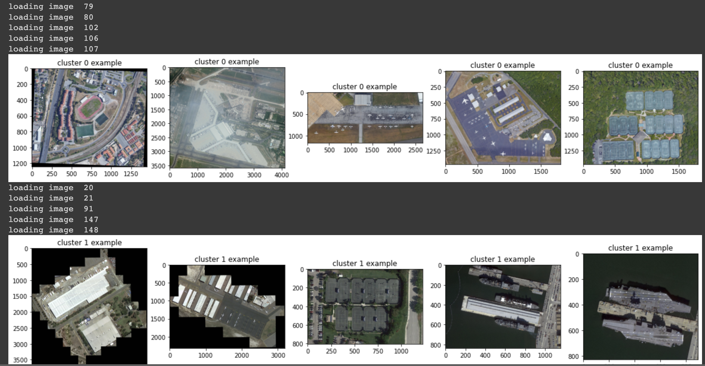

## Projects

---

### -> [Chat with an AI about Jeremy!](/chatbot) <-

---

[AI Tinkerers Presentation](/pdf/Retrieval%20Augmented%20Generative%20AI.pdf)

---

[Data engineering for Canyoneering App](https://github.com/bricepollock/canyoneer)

---

Honors Thesis on Deepfakes (coming soon...)

---

[Self-supervised ML on Satellite Imagery](/pdf/SimCLR%20application%20to%20Satellite%20Imagery.pdf)

### Useful documents about Jeremy

- [Resume](/pdf/Jeremy%20Mumford%20Resume%202023%20Oct%20copy.pdf)

---

---
